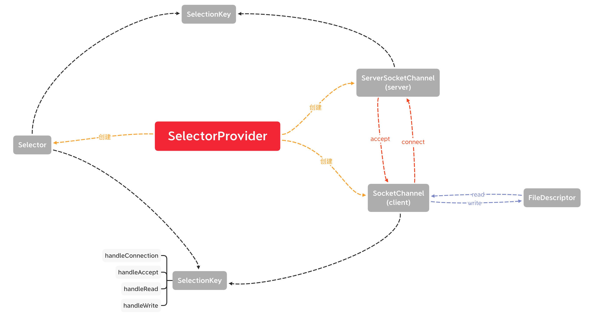
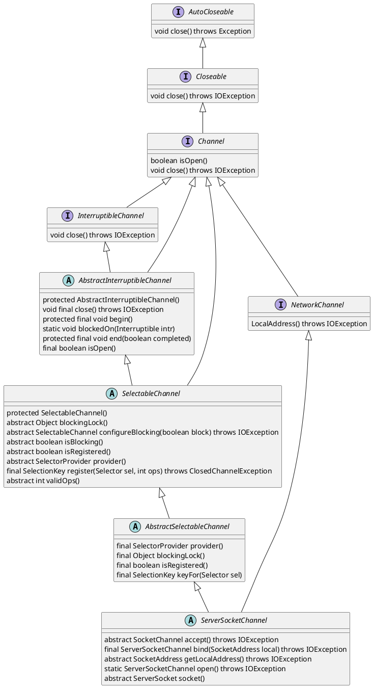
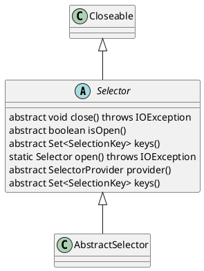
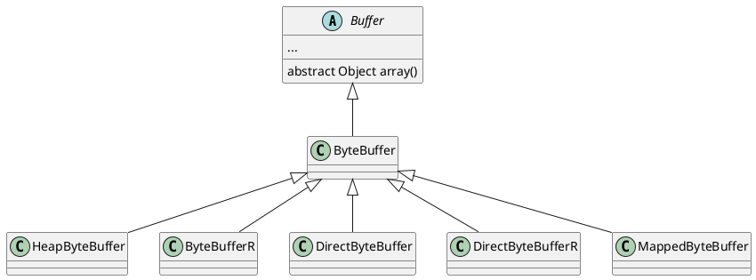

# NIO - non-blocking io

## 网络模型, 此处以tcp请求为例


由单线程的Selector统一协调所有的client请求

## 核心组件

- Selector
- Buffer
- Channel

## 源码解读

### ServerSocketChannel类图



- `protected ServerSocketChannel(SelectorProvider provider)`
  - 这个类需要通过open()方法创建，如果直接通过反射创建出来的类，会出现当前通道打开但是没有绑定的情况，进而抛错: NotYetBoundException
- `public static ServerSocketChannel open() throws IOException`
  - 将SelectorProvider装载到ServerSocketChannel中
  - 建立网络套接字的文件描述符FileDescriptor
  - 记录文件描述符FileDescriptor的索引值fd，该值代表操作系统中某个文件/套接字在内存中的偏移量
  - 初始化state = 0
- `public final int validOps()`
  - 返回一种该通道能够识别的操作方式，由于此处ServerSocketChannel对于一次新的连接只能识别accept操作，因此这里直接返回SelectionKey.OP_ACCEPT
- `public final ServerSocketChannel bind(SocketAddress local) throw IOException`
  - 将套接字和本地地址(包括端口)建立起联系，一旦联系被建立起来，端口也被绑定，直到通道被关闭为止
- `public abstract ServerSocketChannel bind(SocketAddress local, int backlog) throws IOException`
  - 用文件描述符替换tcp协议
  - 用fileDescriptor的内存映射地址去绑定网络地址和端口
  - 通过fileDescriptor的内存映射地址，创建监听请求
  - 绑定过程用了synchronized锁保证不会线程冲突
- `public abstract <T> ServerSocketChannel setOption(SocketOption<T> name, T value) throws IOException`
  - 默认的options包括StandardSocketOptions.SO_RCVBUF、StandardSocketOptions.SO_REUSEADDR、StandardSocketOptions.IP_TOS
    - SO_RCVBUF: the size of socket receive buffer
    - SO_REUSEADDR: re-use address
    - the type of service octet in the internet protocol (IP) header
- `public abstract ServerSocket socket()`
  - 通过ServerSocketAdaptor创建ServerSocket
  ```plantuml
  @startuml
  ServerSocket <|-- ServerSocketAdaptor
  @enduml
  ```
  此处本质上最终通过ServerSocketAdaptor.create(ServerSocketChannelImpl var0)创建了一个ServerSocket对象
- `public abstract SocketChannel accept() throws IOException`
  - 判断当前channel是否打开并绑定（bound）
  - 调用begin(),标记可能无限期阻塞的I/O操作的开始
    - 创建一个打断器，可以在有需要的时候，执行当前通道的关闭方法(需要实现抽象方法)
    - 启动一个新的线程去监听，如果当前线程被中断，就用这个线程去中断当前的线程
  - 根据fileDescriptor(ssc)、fileDescriptor(sc)、InetSocketAddress[]去监听内存中是否有对应的请求
    - 猜测：此处如果能够监听到，会把fileDescriptor绑定到对应的内存偏移量上，且返回内存偏移量的地址
  - 监测到偏移量地址后，调用需要了解AbstractInterruptibleChannel.end(),结束无限期阻塞的IO
  - 根据SelectorProvider、FileDescriptor（sc）、InetAddress{1}获取实际的SocketChannel并返回
- `public abstract SocketAddress getLocalAddress() throws IOException`

#### SelectorProvider-选择器和可选择通道的服务提供方
- `public static SelectorProvider provider()`
  - 从配置中加载provider
    - 从java.nio.channels.spi.SelectorProvider中获得selectorProvider的路径，通过反射获得
  - 通过ClassLoader.getSystemClassLoader()中加载第一个
  - 加载默认的KQueueSelectorImpl
- `public abstract DatagramChannel openDatagramChannel()`: 打通UDP通道
- `public abstract ServerSocketImpl openServerSocketChannel()`: 打通TCP server通道
- `public abstract SocketChannel openSocketChannel()`: 打通TCP client通道
- `public final SelectionKey register(Selector sel, int ops) throws ClosedChannelException`
  - 将当前的channel注册到selector中，返回一个SelectionKey
  - ops：感兴趣的SelectionKey方式


### Selector类图-一个SelectableChannel(可选择通道)的多路复用对象
- 一个SelectionKey代表一个通过Selector注册的可选择通道
- 一个Selector对象必须包含三种类型的SelectionKey集合
  - keys： 当前被注册的keys
  - selectedKeys：在这个集合中的key，已准备好进行至少一项操作，在先前的选择操作期间，已经对这里的key进行了标记
  - cancelledKeys：这里的key已经被注销，但是他们的通道仍未被注销。这里的key不能直接访问
- `public static Selector open() throws IOException`
  - 打开一个Selector，通过SelectorProvider.provider().openSelector()实现
- `public abstract int select() throws IOException`
  - 选择一组键，它对应的通道已经准备好进行IO操作
- `public abstract Set<SelectionKey> keys()`
  - 返回当前Selector的SelectionKey列表
  - SelectionKey不允许被直接修改，且一个key只能在cancel且它的channel被注销以后以后才能被remove
- `public final SelectionKey register(Selector selector, int ops)`
  - 将当前的Channel注册到已经存在的Selector中，并返回一个可选择的key，这个key能够代表当前被注册的这个通道的选择器Selector



#### SelectionKey
- 当一个Channel被注册到一个Selector上的时候，会生成一个SelectionKey
- 直到调用key的cancel方法直接，这个key都一直是有效的
- 调用key的cancel方法时，这个key不会立即从它的Selector中被移除；测试一个key是否有效，需要调用它的`isValid()`来证明
- `public abstract SelectableChannel channel()`
  - 返回创建了该SelectionKey的Channel
- `public abstract Selector selector()`
  - 返回创建了该SelectionKey的Selector
- `OP_READ`
- `OP_WRITE`
- `OP_CONNECT`
- `OP_ACCEPT`


### Buffer类图


- `final byte[] hb`和`boolean isReadOnly`仅用于heap buffer，但是在`ByteBuffer`中定义，是因为这样可以减少访问这些方法所需要的虚拟访问引用次数
- `public static ByteBuffer wrap(byte[] array, int offset, int length)`
  - 将byte数组的内容放到Buffer缓冲区中
- `public abstract ByteBuffer slice()`
  - 当前一个当前buffer的子序列buffer，包含当前buffer的内容
- `public abstract ByteBuffer deplicate()`
  - 复制当前的buffer
- `public abstract byte get()`
  - 读取当前位置的byte，并将buffer的位置+1
- `public abstract byte put(byte b)`
  - 将当前的byte写入到buffer，并把position+1
- `public ByteBuffer get(byte[] dst, int offset, int length)`
  - 将当前位置开始，长度length的buffer中的内容，写入到byte数组中
  - 此时buffer的position = offset + length
- `public ByteBuffer put(ByteBuffer src)`
  - 将src中的内容，写入到当前buffer中
  - 写入的src与当前的buffer不能为同一个(通过地址判断)
  - 此时buffer的position = buffer.org_position(执行put之前) + src.remaining

## 例子

## 引发的问题
- java nio当短时间内向服务端发送消息的时候，如果此时服务端来不及消费，会出现沾包的问题
  - 解决方案：设置自己的包协议，包 = 包内容长度(Length:1) + 包内容
  - 通过上述思路，同样可以解决断包的问题，当包内容长度大于读取到的包内容长度时，可以将当前内容先缓存起来，等到该包内容读全以后，进行包拼装，还原成实际的包内容

## 待跟进
- ServerSocketChannel相关
  - 需要了解SelectorProvider
  - 需要了解Net.class
  - FileDescriptor
  - SecurityManager.class
  - IOUtil.fdVal(FileDescriptor fd);
  - Selector具体是怎么做转发的
    - 通过生成对应的`SelectionKey`，把Channel和Selector关联起来，如果有感兴趣事件进来，会被SelectionKey识别到
  - 访问方法需要的虚拟方法调用数量是什么意思
  - Selector能否生成多个
    - 可以
    - 虽然SelectorProvider是单例，但是在创建Selector的时候没有做固定的限制，因此可以生成多个
  - Selector和Channel中的begin()和end()是做什么的
    - begin()和end()配套用在底层操作的时候，会在begin里给当前线程创建一个interrupt(主要是通过把当前线程加入到`blockOn(Thread t)`中)，如果当前线程处于阻塞的状态，会调用interrupt以唤醒当前线程。在end()里会清除当前的interrupt(主要是通过`blockOn(null)`把阻塞线程清空)

