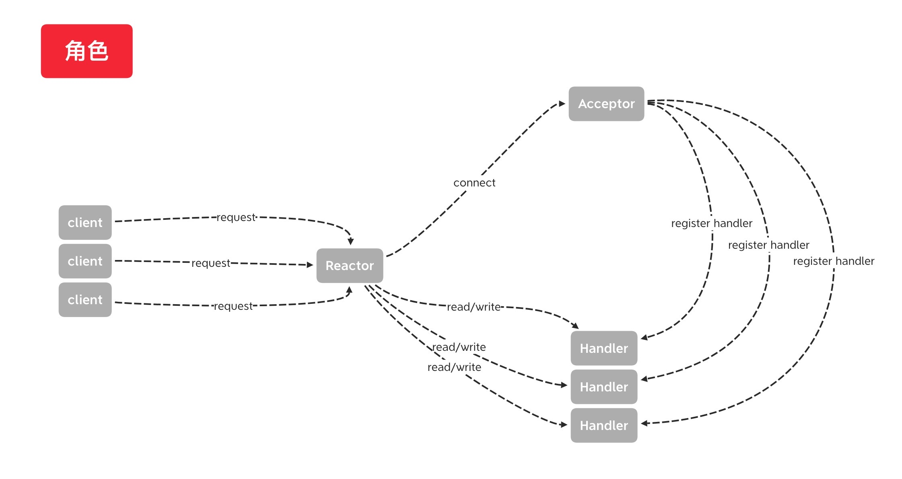
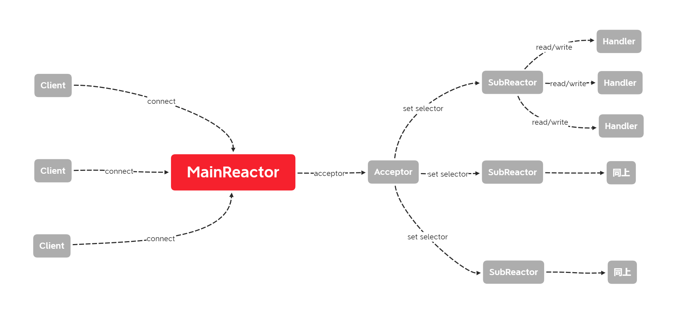

# Reactor模型  

## 单Reactor单线程模型  
### 模型图
  
### 代码示例

### 存在问题
1. 由于Reactor和Handler都是单线程，无法将服务器多核的特性使用起来
2. 所有操作都是在Reactor县城内执行，如果handler的操作耗时太久(涉及到IO、数据库等), 会造成Reactor处理acceptor请求堆积  

## 单Reactor多线程模型  
### 优势
1. 将网络操作和实际的业务逻辑分离，网络操作不会由于业务逻辑复杂造成阻塞
### 存在问题
1. 当大量客户端同时发起请求时，限于线程池的约束，如果handler操作存在耗时的操作，会造成线程池耗尽，后续的任务发生排队，仍然造成请求阻塞的情况

## 多Reactor多线程模型
### 模型图

### 需要注意的问题  
由于SubReactor这里是用线程启动的，因此run在register的时候已经执行了，此处由于selector.select()速度太快，synchronized(this.publicKeys)会一直拿着锁，导致channel.register(selector, ops)时候selector拿不到锁，导致卡住

## 待跟进
- `executorService.submit(() -> method())`, 内部具体是怎么执行的 
    - 新启一个线程池中的线程执行method()
- Java Future实现原理
