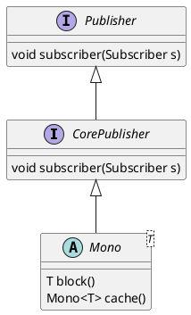

# Webflux
- 响应式编程是一种基于数据流和变化传递的声明式的编程规范  

## lambda表达式练习
### flatMap
### collect
### peek
### reduce

## 从理论到落地的关系
### Reactive Streams API -> Reactor -> Webflux
- Reactive Streams是标准，定义了一套规范化的API
- Reactor是Reactive Streams的实现
- Webflux是基于Reactor，应用于web领域的一套响应式编程框架

## 响应式编程中涉及到的角色
### Publisher
- 产生一个数据流，可能包含无限数据
```java
public interface Publisher<T> {
    void subscribe(Subscriber<? super T> s);
}
```  
### Subscriber
- 接收Publisher创建的元素
- 能够监听指定的事件，如：OnNext, OnComplete, OnError
```java
public interface Subscriber<T> {
    void onSubscribe(Subscription s);
    void onNext(T t);
    void onError(Throwable t);
    void onComplete();
}
```  

### Subscription
- Publisher和Subscriber的一对一协调对象
- Subscriber通过Subscription来向Publisher取消数据发送或者request更多的数据
```java
public interface Subscription{
    void request(long l);
    void cancel();
}
```  

### Processor
- 同时具备Publisher和Subscriber的特征，比如既可以发送数据，又可以接收数据
```java
public interface Processor<T, R> extends Subscriber<T>, Publisher<R> {
    
}
```

## Reactive Streams
### Reactive Program = Streams + Operations
- Streams: 被处理的数据节点
- Operations: 异步处理

### 响应式编程API对比迭代器
-

| event | Iterable(Pull) | Observable(Push) |
| :---- | :----  | :----  |
| retrieve data | next() |  onNext() |
| error | throwable | onError() |
| complete | !hasNext() | onComplete() |  

## Reactor的使用阶段
### 创建阶段
- `Mono.just()`
- `Mono.fromFuture(Future f)`
### 中间处理结果
- 一些`filter`、`map`、`flatMap`、`then`、`zip`、`reduce`等方法
### 最终消费阶段
- 显式调用`subscribe`方法

## 什么是Webflux

## 为什么要使用Webflux

## 代码示例

## 使用webflux实现服务端向客户端定时推送消息的功能

## 核心类源码解读
`abstract class Mono implement org.reactivestreams.Publisher`
### Mono 代表0-1个元素的发布者



### Flux 代表0-多个元素的发布者
`class Flux implement org.reactivestreams.Publisher`

## 相关的接口函数
### 生产函数
`Supplier`
### 消费函数
`Consumer`
### 处理函数
`Function`
### 判定函数
`Predicate`

## 路由相关的接口函数 `RouterFunction`
### 路由方法
`RouteFunctions`
### 请求判定
`RequestPredicate`
### 处理器函数
`HandlerFunction`